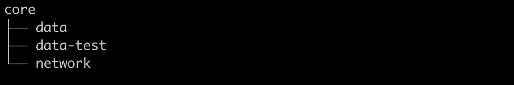
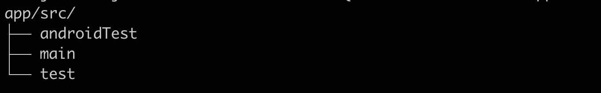
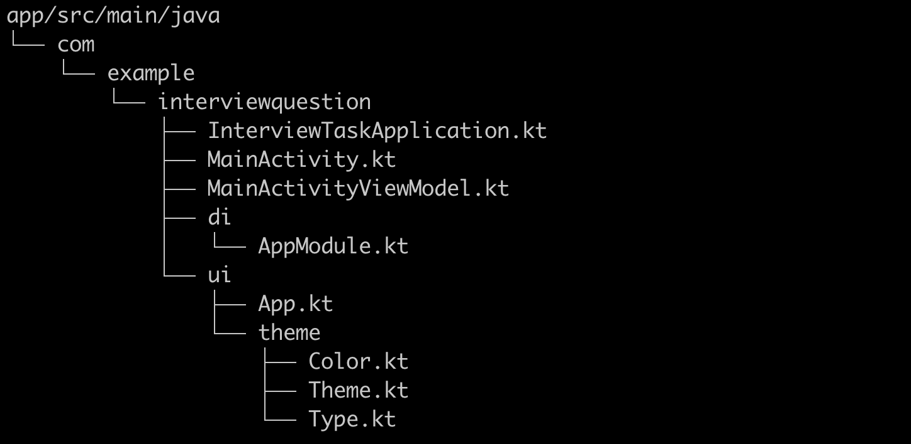
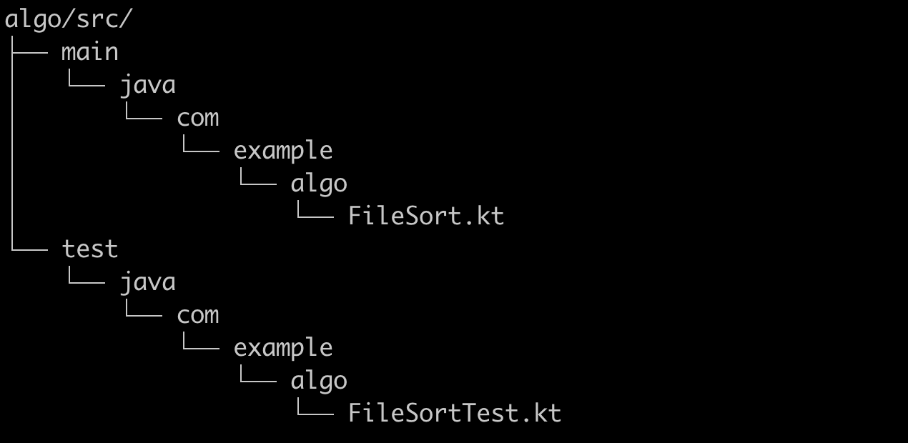

# Interview Task Overview
Dear interviewer, this is a brief summary of my thoughts while completing the tasks.

## First Task

My understanding of the first task was to evaluate candidate's ability to use common Android libraries and best practices.

For the API I provided both Retrofit RestRepository and FakeRepository, there is no API given currnetly FakeRepository is injected using koin.

For the data layer, I provided both a Retrofit RestRepository and a FakeRepository. Currently, the FakeRepository is injected using Koin for simplicity. This demonstrates my understanding of architechtural design patterns and using them to improve testability. 

About original activity code there are some problems, one is tight coupling of data layer which is bad practice for real projects. A better solution is use architectural patterns like MVC, MVP, MVVM. I used MVVM, recommended by Google, to separate the data logic from the UI. The repository acts as the single source of truth, while the viewmodel depends on the repository. Due to the short notice, and  simplicity. I only implemented a fake repository and Rest version. I only had a couple hours to complete the tasks so I didn't implement a offline-first version.

This also solves the unsafe data fetching using GlobalScope which not tied to any lifecycle. After moving fetching logic to vimodel I used `collectAsStateWithLifecycle` api provided by `androidx.lifecycle.compose` library. Now flow collection will tied to ViewModel Scope which is Lifecycle.State.STARTED, See the diagram below.

.

ViewModel which contains ui state also hoisted to the top level Compose component.

## Project Structure:

Project code also splited to multiple modules using layer based modularizing architecture. Code organization followed project structure best practices from Now In Android and Jetpack Compose Samples.

## Core Module

Core module which contains 3 submodule data, data-test, and network.

Data module contains data models and repositories for common for all other module above or in the same level.

Network module contains data models and Retrofit rest api repository for other modules. Again due to short notice I didn't implement Offline first repository that combines both remote and database data sources.

Data test module contains FakeRepository implmentation and data models focoused on testing data layer infrastructure.

## Original Module

Original module contains unchanged  interview question code example with some comments on it.

## App Module

App module is the important module that contains improved implementation of task 1. It includes instrumented ui test, main code that contains the task implementation.

## Algo Module

Algo module contains the second task which I persume about sorting algorithms and Java Comparable and Comparator. It contains task  implementation and test.

If you would like to know more about my architechture skills, below is recuruitment project that I did 5 years ago, which is a HackerNews demo that implements SST(Single Source Of Truth) with OfflineFirst repository using Room. Now it might not be much, butmy architecture ability only grow these 5 years.

[https://github.com/alimjanqadir/news-demo](https://github.com/alimjanqadir/news-demo)

## Second Task:
Second task is about soring, more generally about algorithms. Task description states that we can use standard library. So I didn't implement the sorting algorithm myself. I use standard `Array.sort` which is fast. It uses `DualPivotQuicksort` for primitive types and `TimSort` for Objects. Both has θ(n log n) Time complexity, but TimSort has Ω(n) and O(n log n). QuickSort is faster at Random Data, TimSort is more efficient on ordered data better suited for file sorting. 

For sorting requirement I implemented a custom Comparator, it segments the input to digits and characters, and combine the digits as a single unit. It's for edge cases like `"file1a" < "file10"`.

Overall time complexity is: O(n * (log n) * c), n log n for outersort, c for Comparator which bound to length of filename size. Space Complexity is O(N), which is same as TimSort itself.

## Remark
This small project definitely tons to improve, could be added more tests for all levels from unit test to screenshot test. Of course we can built upon this and make it a real Aumotive related application. I hope this task result gives me a chance to proceed for next round, I have 10 years of Mobile and Android experience to share with you. I also had experince with Automotive platform. We can talk about android internals, framework layer, testing and benchmarking, graphics, sensors, On device Machine Learning and much more.

## Related Materials
Android related:

https://developer.android.com/topic/architecture
https://developer.android.com/topic/modularization
https://developer.android.com/jetpack/compose/state-hoisting
https://developer.android.com/codelabs/jetpack-compose-testing
https://insert-koin.io/
https://square.github.io/retrofit/
https://elizarov.medium.com/reactive-streams-and-kotlin-flows-bfd12772cda4

For sorting:

https://cs.android.com/android/platform/superproject/main/+/main:libcore/ojluni/src/main/java/java/util/Arrays.java;l=106?q=Arrays.sort
https://cs.android.com/android/platform/superproject/main/+/main:libcore/ojluni/src/main/java/java/util/Arrays.java;l=1259?q=Arrays.sort

