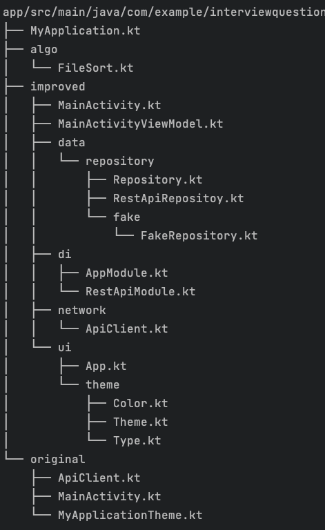

# Interview Task Overview
Hi Mr/Mrs interviewer, this the simple description about my thought when doing the tasks.

## First Task

My understanding of first task is about test wheter candidate can use common Android libraries and whether candidate can utilize best practices.

For the API I provided both Retrofit RestRepository and FakeRepository, there is no API given currnetly FakeRepository is injected using koin.

This also demonstrate my understanding about design patterns and using them to improve Testtability, however because I was notified at last minute I had only a couple of hours to finish the tasks, so I did't implement robust testing, but simple tasks has implemented.

About activity code there are some problems, one tightly coupling of data which is a bad practice in real projects, a better solution is to implment architechtural patterns like MVC, MVP, MVVM. I used MVVM as the code achitecture which is a recommnded solution by Google.

I moved the data logic from UI to data layer, Concept of repository as a single source of truth, viewmodel depends on repository. For simplicity and lack of time, I didn't implement Offline First Repository, just fake repository and a Rest one.

This also solves the unsafe data fetching using GlobalScope which not tied to any lifecycle. after using view model data will tied to ViewModel Scope.

ViewModel and UI also hoised to the top level Compose component.

If you would like to my architechture show case, below is recuruitment project that I did't about 5 years ago, which is HackerNews demo that implements SST(Single Source Of Truth) with OfflineFirst repository using Room.

[https://github.com/alimjanqadir/news-demo](https://github.com/alimjanqadir/news-demo)

Project code also splited to multiple files and packages which follow project structure best practices from Now In Android and Jetpack Compose Samples.

Project Structure:

## Second Task:
Second task is about soring more generally about algorithms. Task description states that we can use standard library. So I didn't implement the Sorting Algorithm myself. I use standard Array.sort which is fast and reliable. it uses `DualPivotQuicksort` for primitive types and `TimSort` for Objects. Both has θ(n log n) Tim complexity, but TimSort has Ω(n) and O(n log n). QuickSort is faster at Random Data, TimSort is more efficient on ordered data better suited for file sorting.

For sorting requirement I implemented a custom Comparator, it segments the input to digits and characters, and combine the digits as a single value. It's for edage cases like file1a < file10.

Overall time complexity is: O(n * (log n) * c), n log n for outersort, c for Comparator which bound to length of filename size. 

## Remark
This small project definitely tons to improve, we can [modularize](https://developer.android.com/topic/modularization) the data layer, could be added test for all levels from unit test to screenshot test. Of course built upon this and make it a real Aumotive related application. I hope this task give a chanced to proceed for next round, I have 10 years of Android experience to share with you. I had experince with Automotive devies. We can talk about android internals, framework layer, testing and benchmarking, graphics, sensors and much more.

## Related Materials
Android related:
https://developer.android.com/topic/architecture
https://developer.android.com/jetpack/compose/state-hoisting
https://insert-koin.io/
https://square.github.io/retrofit/

For sorting:
https://cs.android.com/android/platform/superproject/main/+/main:libcore/ojluni/src/main/java/java/util/Arrays.java;l=106?q=Arrays.sort
https://cs.android.com/android/platform/superproject/main/+/main:libcore/ojluni/src/main/java/java/util/Arrays.java;l=1259?q=Arrays.sort

